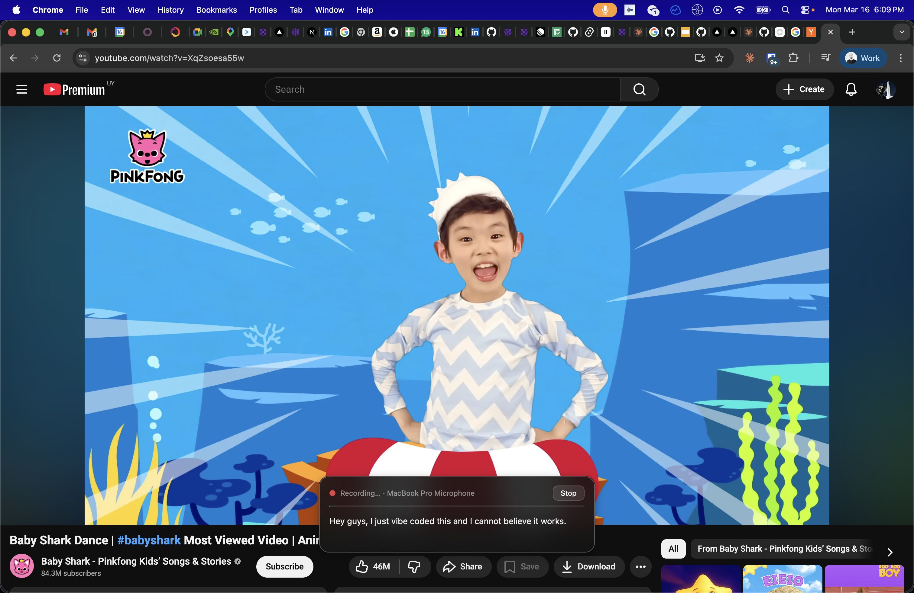

<p align="center">
  
</p>

<h1 align="center">Elevenscribe</h1>

<p align="center">
  Press a hotkey, speak, and your words are typed wherever your cursor is.
</p>

---

Elevenscribe is a macOS menubar app that turns your voice into text using the [ElevenLabs Scribe](https://elevenlabs.io/blog/introducing-scribe-v2) real-time API. Press **⌘ Shift Space** to start recording, speak, then press **⌘ Shift Space** again to stop — the transcript is pasted directly into the active app.

<p align="center">
  
</p>

- Floating overlay shows live transcription as you speak
- Automatically ducks system volume while recording
- Runs silently in the menu bar, always one shortcut away
- Requires an [ElevenLabs API key](https://elevenlabs.io/blog/introducing-scribe-v2)

## Install from Releases

1. Go to the [Releases](../../releases) page and download the latest `.dmg`
2. Open the `.dmg`, drag **Elevenscribe** to your Applications folder
3. Launch the app and enter your ElevenLabs API key when prompted
4. Grant **Accessibility** and **Microphone** permissions if macOS asks

## Build Locally

**Prerequisites:** [Rust](https://rustup.rs), [Node.js](https://nodejs.org), [pnpm](https://pnpm.io)

```bash
git clone https://github.com/pentoai/elevenscribe
cd elevenscribe
pnpm install
pnpm tauri build
```

The `.dmg` will be at `src-tauri/target/release/bundle/dmg/`.

For development with hot-reload:

```bash
pnpm tauri dev
```

## Related

[Epicenter](https://github.com/EpicenterHQ/epicenter) — a more fully-featured ElevenLabs dictation app with more configuration options, if you need something beyond what Elevenscribe offers.

## Contributing

Commits must follow the [Conventional Commits](https://www.conventionalcommits.org) format — this is enforced by a commit-msg hook and drives automatic versioning:

| Prefix                       | Example                        | Version bump          |
| ---------------------------- | ------------------------------ | --------------------- |
| `feat:`                      | `feat: add paste on stop`      | minor `0.1.0 → 0.2.0` |
| `fix:`                       | `fix: restore volume on crash` | patch `0.1.0 → 0.1.1` |
| `feat!:`                     | `feat!: redesign overlay API`  | major `0.1.0 → 1.0.0` |
| `chore:` `docs:` `refactor:` | `chore: update deps`           | no bump               |

When a versioned commit is merged to `main`, a Release PR is opened automatically. Merging it tags the release and triggers the macOS build.
